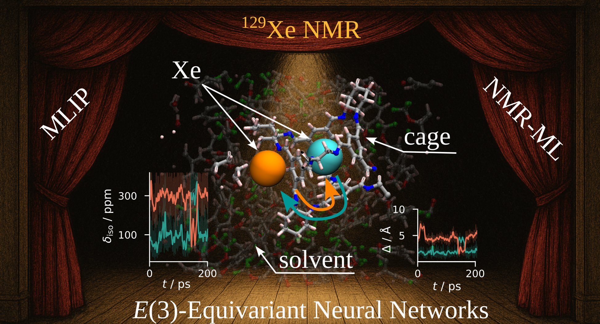

# Supporting Code for “Equivariant Neural Networks Reveal How Host–Guest Interactions Shape <sup>129</sup>Xe NMR in Porous Liquids”

## Graphical Abstract



---
📄 Author: **Ouail Zakary**  
- 📧 Email: [Ouail.Zakary@oulu.fi](mailto:Ouail.Zakary@oulu.fi)  
- 🔗 ORCID: [0000-0002-7793-3306](https://orcid.org/0000-0002-7793-3306)  
- 🌐 Website: [Personal Webpage](https://cc.oulu.fi/~nmrwww/members/Ouail_Zakary.html)  
- 📁 Portfolio: [Academic Portfolio](https://ozakary.github.io/)
---

This is the supporting code for the manuscript “Equivariant Neural Networks Reveal How Host–Guest Interactions Shape <sup>129</sup>Xe NMR in Porous Liquids”. [DOI: To be announced]

The repository contains the following sections:

1. Code for dataset preparation for MLIP:  
   i. Configuration generation using semi-empirical MD (SEMD) simulations. ([directory](./dftb-md/))  
   ii. Single-point DFT calculations of the sampled SEMD snapshots. ([directory](./dft_calculations_vasp/))  
   iii. Dataset formatting for *Allegro* architecture. ([directory](./dft_dataset/))  
3. Code for principal component analysis (PCA). ([directory](./pca_analysis/))
4. Code for t-distributed stochastic neighbor embedding (t-SNE). ([directory](./t-sne_analysis/))  
5. Code for training, validation, and testing of *Allegro* architecture. ([directory](./allegro_architecture/))  
6. Code for machine learning MD simulations. ([directory](./mlmd_simulations/))  
7. Code for dataset preparation for the NMR-ML model:  
   i. Configuration generation using SEMD simulations. ([directory](./dftb-md/))  
   ii. DFT calculations of <sup>129</sup>Xe NMR magnetic shielding tensor, ***σ***. ([directory](./dft_calculations_turbomole/))  
   iii. Dataset formatting for *MatTen* architecture. ([directory](./nmr_dataset/))  
8. Code for training, validation, and testing of *MatTen*. ([directory](./matten_architecture/))  
9. Prediction of <sup>129</sup>Xe ***σ*** from the pre-trained NMR-ML model. ([directory](./nmr-ml_prediction/))  
10. Python scripts and raw numerical data for all figures in the main manuscript and the supporting information. ([directory](./figures/))  

## Citations
If you use the code in this repository, please cite the following:

### Preprint [](https://doi.org/10.26434/chemrxiv-2025-njln9-v2)

```bibtex
@article{zakary_xe-at-cc3-tba_2025,
  title={Equivariant Neural Networks Reveal How Host--Guest Interactions Shape $^{129}$Xe NMR in Porous Liquids},
  author={Zakary, Ouail and Lantto, Perttu},
  journal={ChemRxiv},
  year={2025},
  doi={10.26434/chemrxiv-2025-njln9},
  url={https://doi.org/10.26434/chemrxiv-2025-njln9-v2},
  note={Preprint}
}
```

### Dataset [](https://doi.org/10.5281/zenodo.17105321)

```bibtex
@dataset{zakary_xe-at-cc3-tba_2025,
  author = {Zakary, Ouail and Lantto, Perttu},
  title = {Supporting Data for "Equivariant Neural Networks Reveal How Host--Guest Interactions Shape $^{129}$Xe NMR in Porous Liquids"},
  year = {2025},
  publisher = {Zenodo},
  doi = {10.5281/zenodo.17105321},
  url = {https://doi.org/10.5281/zenodo.17105321}
}
```

### Code [](https://github.com/ozakary/data-Xe_at_CC3_at_TBA)
```bibtex
@misc{zakary_xe-at-cc3-tba_github_2025,
  author = {Zakary, Ouail and Lantto, Perttu},
  title = {Supporting Code for "Equivariant Neural Networks Reveal How Host--Guest Interactions Shape $^{129}$Xe NMR in Porous Liquids"},
  year = {2025},
  publisher = {GitHub},
  journal = {GitHub repository},
  howpublished = {\url{https://github.com/ozakary/data-Xe_at_CC3_at_TBA}},
  url = {https://github.com/ozakary/data-Xe_at_CC3_at_TBA}
}
```

---
For further details, please refer to the respective folders or contact the author via the provided email.
